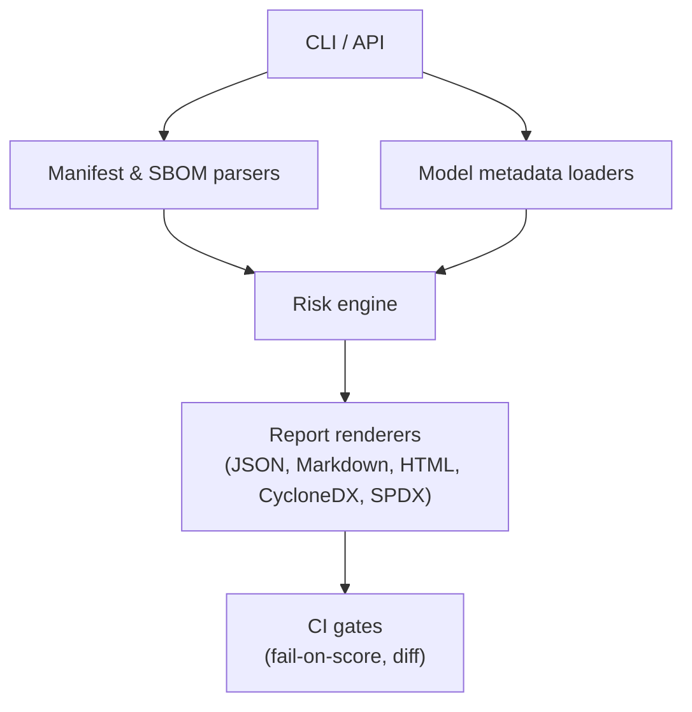

# AI-BOM Inspector


Offline-first SBOM + AI supply-chain risk and license scanner. Privacy posture: default is `--offline` (no network calls) unless you opt into `--online`. Local-first; optional enrichment (OSV/HF/Shadow-UEFI) can be enabled explicitly. Fully offline supported. The "AI" is transparent rules + heuristics with an optional summarizer hook that is stubbed/disabled until you wire in your own LLM.

## Architecture at a glance



The scanner defaults to local-only analysis: it ingests manifests/SBOMs, can layer in optional OSV/Hugging Face lookups, and emits reports that CI can enforce. Network enrichment (OSV, Hugging Face, Shadow-UEFI-Intel metadata) only occurs when you deliberately pass `--online` and enable the relevant feature flag.

## Repository layout

```
ai-bom-inspector/
  crates/
    core/                       # parsing, normalization, scoring (Rust extension)
    licenses/                   # license rules, SPDX mapping
    advisories/                 # CVE ingestion adapters (OSV/NVD/etc)
    report/                     # JSON/MD/SARIF outputs + diff support
  src/                          # Python package (aibom_inspector)
  policies/
    examples/
      default.yml
      strict.yml
      oss-friendly.yml
  schemas/
    policy.schema.json
    report.schema.json
  integrations/
    github-action/              # composite action wrapper for CI
    pre-commit/                 # reusable hook definition
  docs/
    QUICKSTART.md
    POLICY.md
    SCORING.md
    FAQ.md
  .github/
    workflows/
      ci.yml
      scan-pr.yml               # runs on PR and posts summary
  tests/
  README.md
```

## What it does
- Parse dependency manifests across Python (`requirements.txt`, `pyproject.toml`), JavaScript (`package.json` / `package-lock.json`), Go (`go.mod`), and Java (`pom.xml`)
- Ingest existing SBOMs (`--sbom-file`) and export CycloneDX or SPDX alongside AI-BOM extensions
- Gather AI model metadata from JSON or explicit Hugging Face IDs (bring your own JSON or HF IDs; no automatic pipeline discovery)
- Apply heuristics for pins, stale models, license posture (permissive vs copyleft vs proprietary vs unknown), and optional CVE lookups via OSV
- Emit JSON, Markdown, HTML, CycloneDX, or SPDX reports with risk breakdowns driven by explainable heuristics; the optional AI-summary hook is disabled by default and ready for teams to wire up their own LLM if they choose
- Optionally pull firmware research context from [Shadow-UEFI-Intel](https://github.com/MellyFinnese/Shadow-UEFI-Intel) when `--online --enable-shadow-uefi-intel` is used

The default reports only use the deterministic heuristics listed below; the "AI summary" field is a stubbed, human-readable placeholder so teams can wire in their own LLM if desired without expecting hosted inference out of the box.

## Network behavior
- Global posture: `--offline` is the default and hard-blocks every remote call. Expect `[OFFLINE_MODE]` / `[CVE_LOOKUP_SKIPPED]` annotations in reports when enrichment is skipped.
- Opt-in enrichment: add `--online` to allow outbound calls, then enable specific feeds (e.g., `--with-cves`, `--model-id`, `--enable-shadow-uefi-intel`) to choose what actually dials out.
- Endpoints and payloads:

| Endpoint | When it fires | Data sent | How to disable |
| --- | --- | --- | --- |
| `https://api.osv.dev/v1/query` (or `OSV_API_URL`) | `--online` **and** `--with-cves` | JSON body containing `package.name`, `package.ecosystem`, and `version` for each dependency | Default offline; omit `--with-cves`; keep `--offline`; or point `OSV_API_URL` to an internal mirror |
| `https://huggingface.co/api/models/<id>` (or `huggingface_hub` SDK) | `--online` with `--model-id` or models whose `source` is `huggingface` | Model identifier only; response cached locally | Default offline; avoid `--online`; or provide a fully populated `models.json` |
| GitHub API for [Shadow-UEFI-Intel](https://github.com/MellyFinnese/Shadow-UEFI-Intel) | `--online` **and** `--enable-shadow-uefi-intel` | Repository metadata fetch; no project data sent | Default is disabled; leave `--enable-shadow-uefi-intel` off or keep `--offline` enabled |
| Future feeds | Any new integrations (documented as added) | Varies by feed | Default offline; disable the specific feature flag; or run with `--offline` |

Timeouts can be tuned via `--osv-timeout`, `--shadow-uefi-timeout`, or the `OSV_API_TIMEOUT` / `SHADOW_UEFI_INTEL_TIMEOUT` environment variables.

## Installation
- **From source (current canonical path):**
  ```bash
  pip install -e .[dev]
  # Or install straight from GitHub without cloning:
  pip install "git+https://github.com/aibom-inspector/AI-BOM-Inspector.git#egg=aibom-inspector"
  # For fully pinned, reproducible envs (CI/audits):
  pip install -r requirements.txt
  ```

## Getting started
1. Create a `models.json` file if you want to include model metadata. A ready-to-use sample lives in `examples/models.sample.json`:
   ```json
   [
     {"id": "gpt2", "source": "huggingface", "license": "mit", "last_updated": "2024-01-01"},
     {"id": "custom-embedder", "source": "private"}
   ]
   ```
2. Run the scanner (auto-detects dependency files when present):
   ```bash
   aibom scan --models-file models.json --format html --output report.html
   ```
   Run `aibom scan --help` for the full list of options and supported formats.

   Network calls are off by default; add `--online` (plus flags like `--with-cves` or `--model-id`) if you want remote enrichment.

### Who is this for?
- AppSec and security engineers who want CI/CD-friendly AI-BOMs without shipping code to a third party
- MLOps/platform teams who need model metadata (license, freshness, advisories) next to dependencies
- Builders who want tweakable, explainable rules instead of black-box scanners

### Why this vs. Snyk & friends?
- **Small, OSS, local-first**: zero data leaves your laptop or CI box.
- **AI-stack aware**: treats models as first-class assets instead of opaque blobs.
- **Customizable rules**: heuristics are readable Python, not black-box policies.
- **Offline gates + allowlists + model-as-asset scoring**: enforce allowlisted model sources, run fully offline by default, and score models/dependencies together—capabilities that hosted scanners often treat as optional add-ons.

## Examples
- **End-to-end demo** (`examples/demo/`): tiny app with `requirements.txt`, `pyproject.toml`, `package-lock.json`, `go.mod`, `models.json`, and generated `aibom-report.json/md/html`.
  - HTML report snapshot: open `examples/demo/aibom-report.html`
  - Markdown rendering snapshot: see `examples/demo/aibom-report.md`
  - Before/after hygiene comparison: `docs/screenshots/before-after.html`

  Small JSON excerpt (full file in `examples/demo/aibom-report.json`):
  ```json
  {
    "stack_risk_score": 30,
    "risk_breakdown": {"unpinned_deps": 3, "unverified_sources": 0, "unknown_licenses": 1, "stale_models": 1},
    "dependencies": [{"name": "urllib3", "issues": ["[KNOWN_VULN] CVE-2019-11324: CRLF injection when retrieving HTTP headers"]}],
    "models": [{"id": "gpt2", "issues": ["[STALE_MODEL] Model metadata is stale", "[MODEL_ADVISORY] Known prompt-stealing leakage advisory (demo feed)"]}]
  }
  ```
- **Screenshots:**
  - HTML report: open `examples/demo/aibom-report.html`
  - Markdown rendering: view `examples/demo/aibom-report.md`
  - Before vs. after: open `docs/screenshots/before-after.html`
- **Sample models file:** `examples/models.sample.json`
- **Sample Markdown report:** `examples/report.sample.md`
- **Example commands:**
  - Only dependency scan with autodetection: `aibom scan --format json`
  - Include models from a file: `aibom scan --models-file examples/models.sample.json --format markdown --output report.md`
- Specify models inline: `aibom scan --online --model-id gpt2 --model-id meta-llama/Llama-3-8B --format html`
- Enrich CVEs during the scan: `aibom scan --online --with-cves --format json`
- Include non-Python manifests: `aibom scan --manifest package-lock.json --manifest go.mod --format json`
- Import an SBOM: `aibom scan --sbom-file path/to/cyclonedx.json --format html --output merged-report.html`
- Run fully offline (no OSV/HF calls): `aibom scan --format markdown`
- Require inputs or fail fast: `aibom scan --require-input`
- Export CycloneDX: `aibom scan --format cyclonedx --sbom-output aibom-cyclonedx.json`
- Fail CI if health score < 70: `aibom scan --fail-on-score 70 --format html`
- Inspect model weights directly (detect NaNs/LSB steganography): `aibom weights my_model.safetensors --json`
  - Quick comparison of two runs: `aibom diff aibom-report-old.json aibom-report-new.json`

### 30-second sample report (before vs. after)
- **Input SBOM**: lightweight CycloneDX with a few Python and npm components plus a Hugging Face model ID.
- **Before (messy state)**:
  - Command: `aibom scan --sbom-file examples/demo/aibom-report.json --format markdown --output before.md --fail-on-score 70`
  - Top findings: `MISSING_PIN` for multiple deps, `UNKNOWN_LICENSE` on the model, `STALE_MODEL`, demo `KNOWN_VULN` entry, and `UNVERIFIED_SOURCE`.
  - Outcome: `stack_risk_score` ≈ 50 and exit code **1** because it failed the `--fail-on-score 70` gate.
- **After (hardened state)**:
  - Command: `aibom scan --sbom-file examples/demo/aibom-report.json --models-file examples/models.sample.json --format markdown --output after.md --fail-on-score 70 --online --with-cves`
  - Top findings: `CVE` hits (if any) plus minor governance nits; pins and licenses quiet down once manifests and model metadata are cleaned up.
  - Outcome: `stack_risk_score` in the high 80s and exit code **0**, making it CI-safe.

### AI-BOM extensions

CycloneDX and SPDX exports include AI-BOM extension data (e.g., `aibom:source`, license category, risk score, and issues) alongside the standard SBOM fields. See `docs/ai-bom-extensions.md` for the JSON schema and how each extension maps into CycloneDX properties and SPDX summaries.

### Standards alignment
- **AI-BOM schema mapping**: `schemas/report.schema.json` tracks the AI-BOM JSON conventions and is structured to align with the TAIBOM-style trust/attestation fields emerging in the community (e.g., explicit model source, license, provenance, and risk signals).
- **CycloneDX/SPDX bridges**: the CycloneDX/SPDX exporters project `aibom:*` properties into vendor-neutral fields so the output can slot into existing SBOM pipelines without custom parsers.
- **Reference-first posture**: schema updates aim to follow the AI-BOM working drafts; additions are scoped so teams can diff their SBOMs against the schema and treat this project as a reference implementation rather than a one-off tool.

### Output formats at a glance
See `docs/OUTPUTS.md` for a side-by-side JSON, SARIF, and CycloneDX example plus guidance on when to use each.

### Adoption defaults
- **Gates to start with**: fail CI on `--fail-on-score 70`, require allowlisted model sources (`--require-input` plus allowlist rules in `policies/examples/*`), and keep `--offline` as the default posture.
- **CI vs. local**: run `aibom scan --format json --output aibom-report.json --fail-on-score 70` in CI, then publish CycloneDX/SPDX via `--format cyclonedx` or `--format spdx` for downstream compliance jobs. Locally, add `--format html` or `--format markdown` for readability and iterate with `--diff` against previous runs.
- **Policy cookbook**: see `docs/POLICY_COOKBOOK.md` for OSS-friendly, enterprise-strict, and regulated defaults that can be copied into your own policy file.

Configuration tips:

- OSV enrichment uses the public API by default; override with `--osv-url` or `OSV_API_URL` and adjust the HTTP timeout via `--osv-timeout` or `OSV_API_TIMEOUT`.

## Heuristics & Risk Signals
AI-BOM Inspector ships with lightweight, explainable checks that map to common AI supply-chain issues:

| Code | What it means | Severity |
| --- | --- | --- |
| `MISSING_PIN` | Dependency version not pinned with `==`/`~=` | High |
| `LOOSE_PIN` | Dependency uses a range (`>=`, `<=`, etc.) | Medium |
| `UNSTABLE_VERSION` | Pre-1.0 releases that may churn | Medium |
| `KNOWN_VULN` / `CVE` | Known vulnerable versions (built-in heuristics + optional OSV lookup; recommends safer versions when known) | High |
| `LICENSE_RISK` | Copyleft / reciprocal terms detected for a model | Medium |
| `UNKNOWN_LICENSE` | Model or SBOM component lacks license metadata | High |
| `STALE_MODEL` | Model metadata older than ~9 months | Medium |
| `UNVERIFIED_SOURCE` | Non-standard model source value | Medium |
| `MODEL_ADVISORY` | Model flagged by a published advisory | High |
| `OFFLINE_MODE` / `CVE_LOOKUP_SKIPPED` | Scan ran offline or without network dependencies; no remote enrichment performed | Low |
| `METADATA_UNAVAILABLE` | Model registry/API could not be reached; metadata reused from cache with a warning | Low |
| `INVALID_SBOM` | SBOM could not be parsed; flagged as an issue instead of crashing the scan | Medium |

The report shows a `stack_risk_score` (0–100, higher is healthier) and a `risk_breakdown` capturing unpinned deps, unverified sources, unknown licenses, stale models, and CVE hits. Tune the scoring with `--risk-max-score`, per-severity `--risk-penalty-*` flags, and governance/CVE penalties so teams can calibrate what “red” means for them. Conceptually, this is a health score: penalties are subtracted from the maximum, so `--fail-on-score 70` means “fail if health drops below 70/100.”

### How the risk score is computed
- Start from `risk_settings.max_score` (default 100) and subtract penalties instead of adding danger points.
- Every dependency/model issue subtracts `risk_settings.penalty_for(severity)` (default high=8, medium=4, low=2).
- Governance penalties subtract an extra `governance_penalty` for each unpinned dependency and unverified model source; CVE hits subtract `cve_penalty` to emphasize known exploit paths.
- The resulting value is clamped between 0–`max_score`, giving you a “health score” you can fail CI on via `--fail-on-score`.

### Recommended scoring policy
- **Start conservative**: gate on `--fail-on-score 70` while teams pilot the tool; after triage, ratchet up to **80** once noisy signals are addressed.
- **Respond by signal type**:
  - `MISSING_PIN` / `LOOSE_PIN`: add explicit `==` pins (or `~=` if you must) and commit lockfiles.
  - `UNKNOWN_LICENSE` / `LICENSE_RISK`: annotate licenses in `models.json` and prefer permissive alternatives when available.
  - `STALE_MODEL`: update to a fresher model release or document a waiver in `models.json`.
  - `KNOWN_VULN` / `CVE`: upgrade to the suggested safe version; if blocked, add a comment in your SBOM or pin to a patched fork.
  - `UNVERIFIED_SOURCE`: source models from trusted registries (Hugging Face, internal artifactory) and record provenance.
  - `OFFLINE_MODE` / `CVE_LOOKUP_SKIPPED`: rerun with network access before shipping to ensure enrichment isn’t missing critical advisories.

### Assumptions and known limitations
- **Offline mode trades fidelity for privacy:** metadata/CVE lookups are skipped; issues are marked with `OFFLINE_MODE` / `CVE_LOOKUP_SKIPPED` so reviewers know enrichment was suppressed.
- **SBOM trust but verify:** malformed SBOMs are surfaced as `INVALID_SBOM` issues and ignored otherwise; well-formed CycloneDX/SPDX inputs are merged into the dependency set.
- **Model metadata freshness depends on registries:** network failures are tolerated and recorded as `METADATA_UNAVAILABLE`, but license/freshness signals may be stale until the registry is reachable again.
- **Weight inspection is heuristic:** the safetensors scanner samples bits and looks for NaNs/Inf/LSB bias; unusual dtypes or truncated files raise clear errors instead of silently passing.

### Before vs. after hardening

| Scenario | Risk score | Signals |
| --- | --- | --- |
| **Messy AI stack** | 48/100 | Unpinned `package-lock.json`, unknown model license, stale model metadata |
| **Hardened AI stack** | 88/100 | All deps pinned, permissive licenses, fresh model metadata, no advisories |

### Example: scanning a real project
```bash
aibom scan --requirements requirements.txt --models-file models.json --with-cves --format html --output report.html \
  --risk-penalty-high 10 --risk-penalty-medium 5 --risk-penalty-low 2
```
Pair it with `aibom diff report-old.json report-new.json` to highlight PR drift, or run in CI with `--fail-on-score 70`.


## Testing and CI
- Run unit tests: `pytest`
- GitHub Action: `.github/workflows/scan-pr.yml` uses the bundled composite action to scan PRs and post a risk comment.
- Copy/paste workflow example (offline by default; recommended `--fail-on-score` = 75, allowlist supported via `ALLOWED_ISSUE_CODES`):
  ```yaml
  name: AI-BOM Inspector
  on: [pull_request]
  jobs:
    scan:
      runs-on: ubuntu-latest
      steps:
        - uses: actions/checkout@v4
        - name: Install AI-BOM Inspector
          run: pip install aibom-inspector
        - name: Scan AI stack (offline by default)
          run: aibom scan --format json --output aibom-report.json --fail-on-score 75 --require-input
        - name: Enforce allowlist (optional)
          env:
            ALLOWED_ISSUE_CODES: '["OFFLINE_MODE","CVE_LOOKUP_SKIPPED"]'
          run: |
            disallowed=$(jq --argjson allowed "$ALLOWED_ISSUE_CODES" '[.dependencies[]?.issues[]?.code, .models[]?.issues[]?.code] | map(select(. != null and ($allowed | index(.) | not))) | length' aibom-report.json)
            if [ "$disallowed" -gt 0 ]; then
              echo "Unapproved issues detected"; exit 1;
            fi
        - name: Upload human report
          run: aibom scan --format markdown --output aibom-report.md
        - name: Upload artifacts
          uses: actions/upload-artifact@v4
          with:
            name: aibom-report
            path: |
              aibom-report.json
              aibom-report.md
  ```
- CI guardrails: keep `--offline` unless you need enrichments; when allowed, add `--online --with-cves` to the scan step and adjust allowlists accordingly.

## Releases and distribution
- **Tagged releases**: we cut signed Git tags for CLI milestones; package metadata lives in `pyproject.toml` and tracks the changelog.
- **PyPI**: publishing is planned under the `aibom-inspector` name; until then, install from source (`pip install -e .[dev]`) or lock to a tag tarball.
- **Versioning**: semantic-ish—patch releases for heuristics/docs, minor bumps when report schemas or exit codes change.

## Security, governance, and contributions
- See `SECURITY.md` for how to report vulnerabilities.
- See `CODE_OF_CONDUCT.md` for community standards.
- See `CONTRIBUTING.md` for development conventions and how to propose changes.
- `CHANGELOG.md` tracks notable updates.
