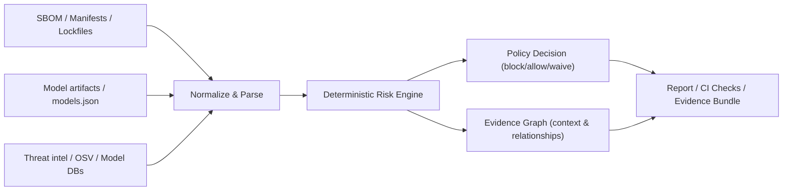

# Threat / Risk Data Flow

Notes:
- The deterministic engine evaluates normalized inputs and produces findings and a score.
- The evidence graph is used for impact analysis and explanation; it does not change the deterministic score.
- CI gates consume the policy decision and evidence bundle for enforcement.